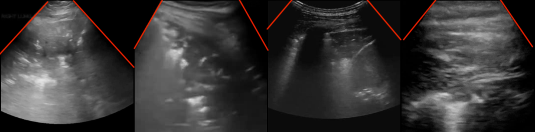
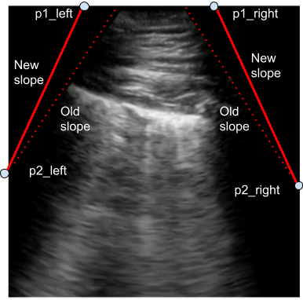
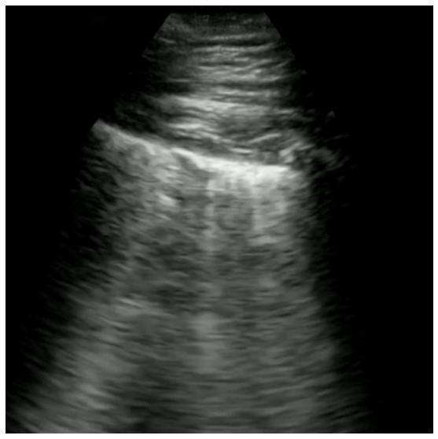
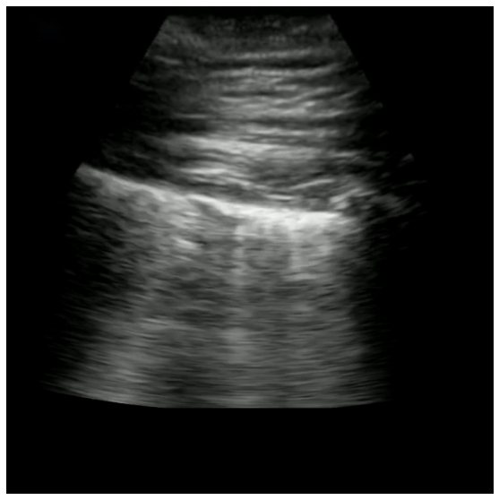
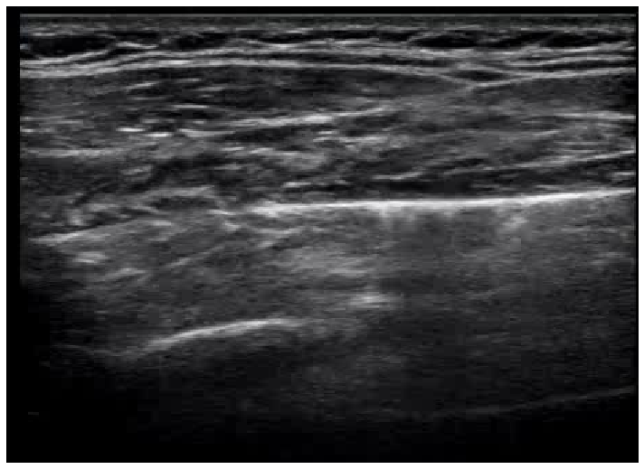
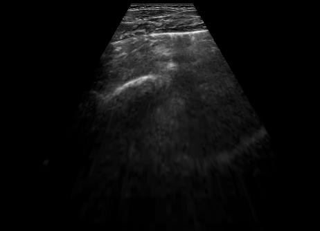
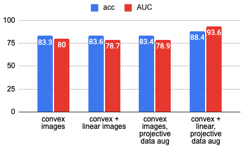

# COVID-Net US-X Extended Linear Convex Ultrasound Augmentation

This code is for the paper **COVID-Net US-X: Enhanced Deep Neural Network for Detection of COVID-19 Patient Cases from Convex Ultrasound Imaging Through Extended Linear-Convex Ultrasound Augmentation Learning** 

**Link to the [paper](https://arxiv.org/abs/2204.13851)**

**COVID-Net US-X is core part of COVID-Net, a global open source, open access initiative dedicated to accelerating advancement in machine learning to aid front-line healthcare workers and clinical institutions around the world fighting the continuing pandemic. Link to COVID-Net portal: [here](https://alexswong.github.io/COVID-Net/)**

**Recording to webinar on [How we built COVID-Net in 7 days with Gensynth](https://darwinai.news/fny)**

**Note: The COVID-Net models provided here are intended to be used as reference models that can be built upon and enhanced as new data becomes available. They are currently at a research stage and not yet intended as production-ready models (not meant for direct clinical diagnosis), and we are working continuously to improve them as new data becomes available. Please do not use COVID-Net for self-diagnosis and seek help from your local health authorities.**

**Pretrained models can be downloaded here: https://drive.google.com/drive/folders/11K6jntAc-72Uq5IMfpFHExO0naqvxub2?usp=sharing. Note that this pretrained COVID-Net US-X v2 model possesses a new machine-designed architecture based on the latest COVIDx US benchmark dataset, which is substantially larger and more diverse than that used in the study.  As such, the final performance results here differ from that presented in the study**

## Abstract

As the global population continues to face significant negative impact by the on-going COVID19 pandemic, there has been an increasing usage of point-of-care ultrasound (POCUS) imaging as a low-cost and effective imaging modality of choice in the COVID-19 clinical workflow. A major barrier with widespread adoption
of POCUS in the COVID-19 clinical workflow is
the scarcity of expert clinicians that can interpret POCUS examinations, leading to considerable interest in deep learning-driven clinical decision support systems to tackle this challenge.
A major challenge to building deep neural networks for COVID-19 screening using POCUS is
the heterogeneity in the types of probes used to
capture ultrasound images (e.g., convex vs. linear
probes), which can lead to very different visual
appearances. In this study, we explore the impact
of leveraging extended linear-convex ultrasound
augmentation learning on producing enhanced
deep neural networks for COVID-19 assessment,
where we conduct data augmentation on convex
probe data alongside linear probe data that have
been transformed to better resemble convex probe
data. Experimental results using an efficient deep
columnar anti-aliased convolutional neural network designed via a machined-driven design exploration strategy (which we name COVID-Net
US-X) show that the proposed extended linearconvex ultrasound augmentation learning significantly increases performance, with a gain of 5.1%
in test accuracy and 13.6% in AUC.


<p align="center">
	
	<br>
	<em></em>
</p>

_An example of ultrasound images with different viewing windows. The bounds of the viewing windows are marked in red._

## Methods

<p align="center">
	
	<br>
	<em></em>
</p>

To generate a random transformation:

1. Using the bounds of an ultrasound image defined by the corner points {p1left, p2left, p1right, p2right}, find a new slope based on the distribution N(old slope, σ).
2. Define new points using the new slope. 
3. Estimate a transformation matrix based on the corner points


|Original|Transformed|
|---------|---------|
|<figure align="center"><figcaption> (a) </figcaption> </figure> | <figure align="center"><figcaption> (b) </figcaption></figure>
|<figure align="center"> <figcaption> (c) </figcaption></figure> | <figure align="center"><figcaption> (d) </figcaption></figure>|

_Projective data augmentation on convex
ultrasound images (b) and linear ultrasound images
(d)_

## Results

<p align="center">
	
	<br>
	<em></em>
</p>

## Contact
If there are any technical questions after the README, FAQ, and past/current issues have been read, please post an issue or contact:

ezzeng@uwaterloo.ca

## Citation

```
@article{zeng2022covid,
  title={COVID-Net US-X: Enhanced Deep Neural Network for Detection of COVID-19 Patient Cases from Convex Ultrasound Imaging Through Extended Linear-Convex Ultrasound Augmentation Learning},
  author={Zeng, E Zhixuan and Florea, Adrian and Wong, Alexander},
  journal={arXiv preprint arXiv:2204.13851},
  year={2022}
}
```

## Setup:
Required python libraries can be found in `requirements.txt`

Install COVID-US data by following instructions [here](https://github.com/nrc-cnrc/COVID-US)

Train/valid/test split is shown in `COVID-Net-US-projective-augs/labels`

## Evaluation

Make sure that `eval_hyperparameters.json` is pointing to the desired model path, then run `python eval.py`. The results would be saved to the same directory. Model paths can also use pattern matching accepted by [glob](https://docs.python.org/3/library/glob.html) such as `"runs/*/model.pth"`

## Notebooks
There are some jupyter notebooks in the `notebooks` folder that might be useful for demos, testing, etc.

`notebooks/image_warping.ipynb` is useful for testing projective and piecewise affine warping found in `random_warp.py`. `notebooks/test_dataloader.ipynb` runs the train dataloader given settings in `hyperparameters.json` to view the resulting images. `image_warping.ipynb` allows for looking at specific images and setting specific degrees of warping while `test_dataloader.ipynb` shows randomized results.